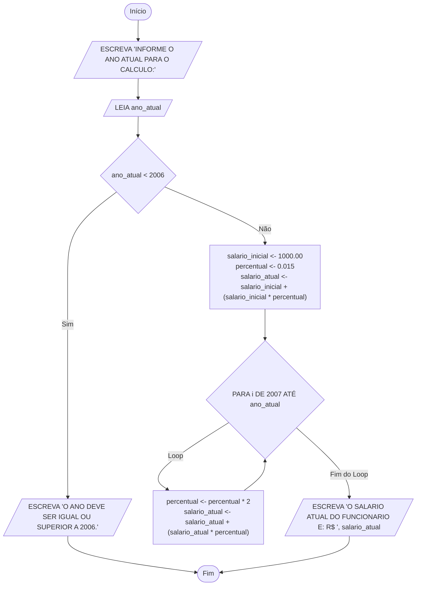
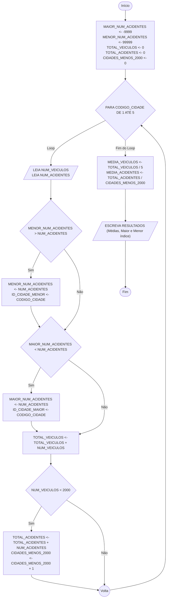
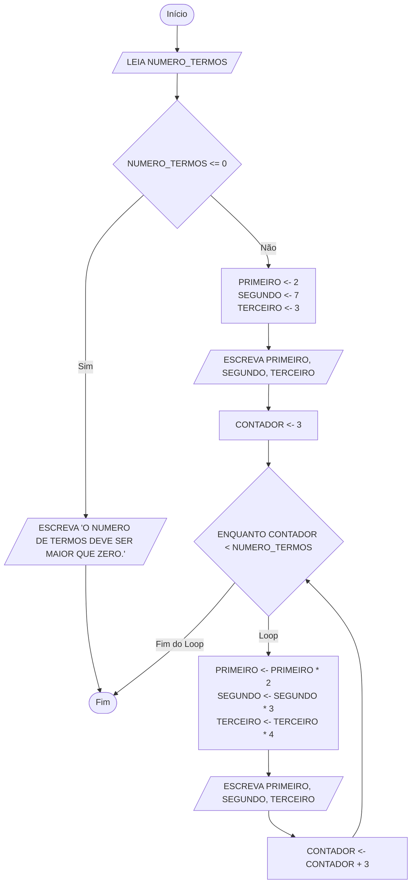
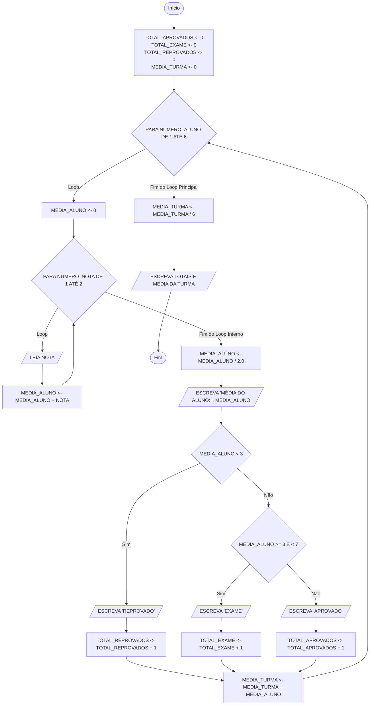
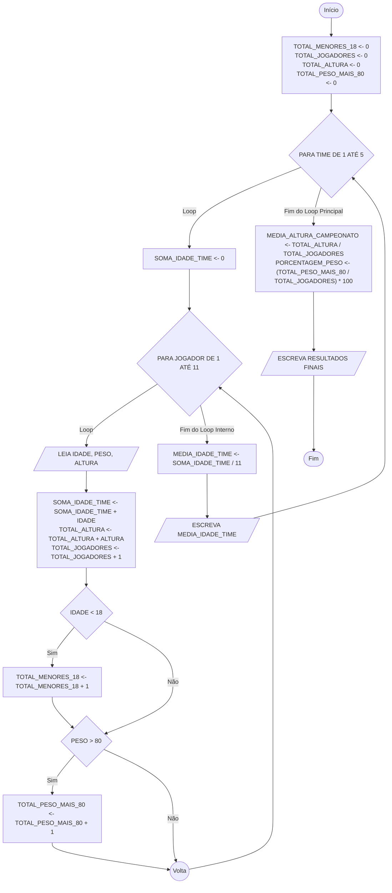
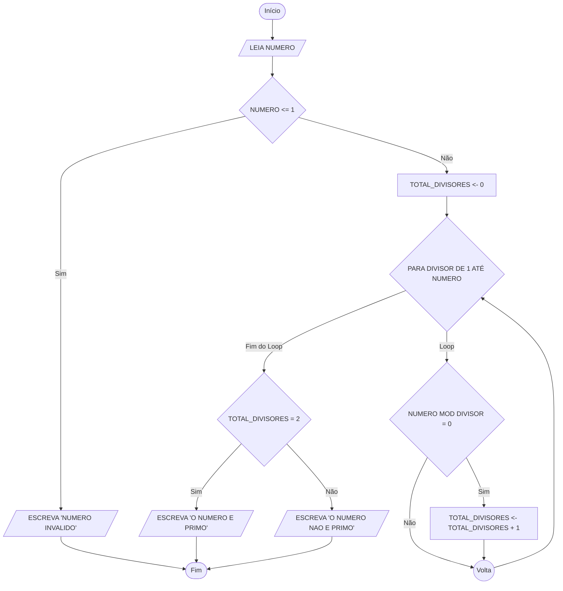
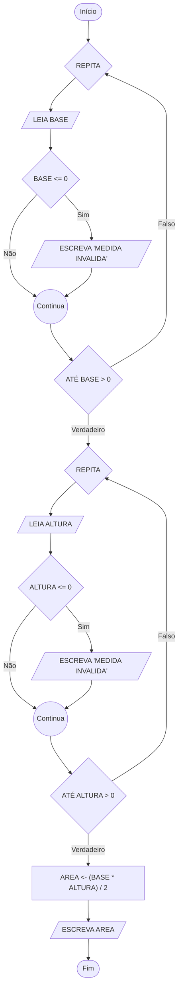
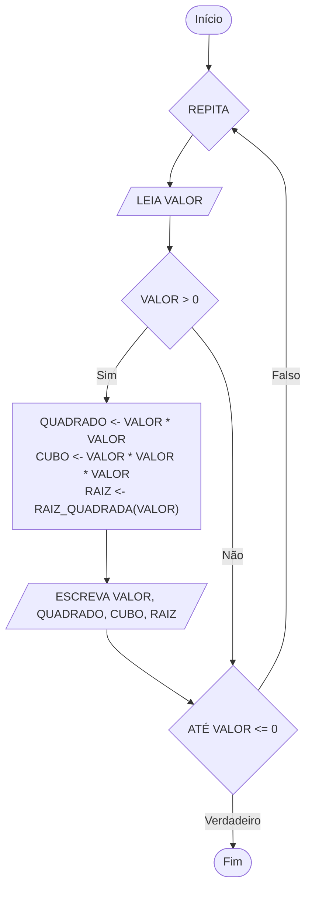
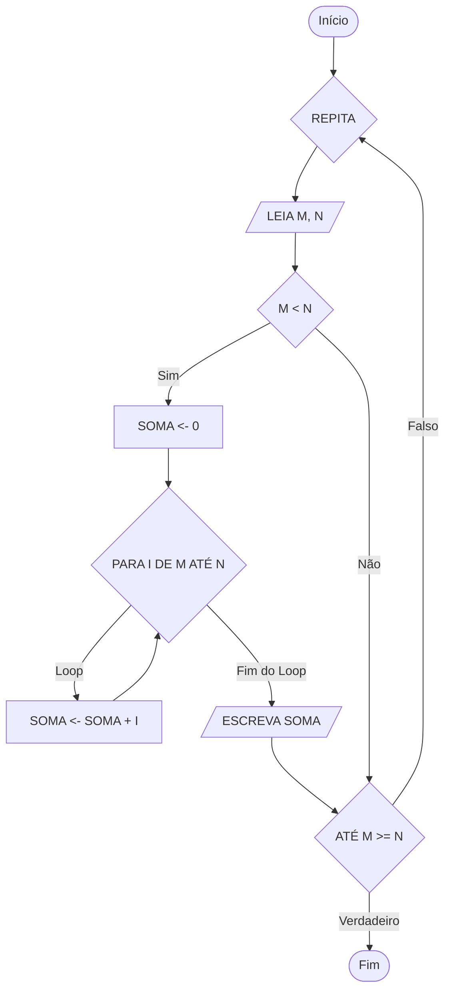

### 1. Cálculo de Aumento Salarial

---

### 2. Estatística de Acidentes de Trânsito

---

### 3. Série Numérica

---

### 4. Média de Notas de Alunos

---

### 5. Campeonato de Futebol

---

### 6. Verificação de Número Primo

---

### 7. Área do Triângulo com Validação

---

### 8. Quadrado, Cubo e Raiz

---

### 9. Soma de Pares (M e N)

